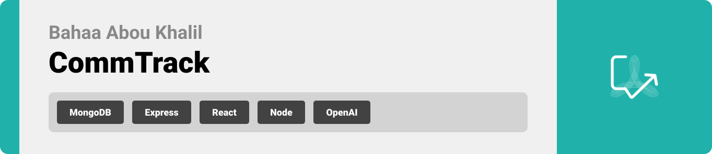

<br><br>

<!-- project philosophy -->


> CommTrack is designed to improve communication and collaboration within teams by working directly with Slack.
>
> As a Slack app, it allows users to track and manage their behavior, engagement, and productivity. This integration helps keep teams connected, motivated, and focused on their goals, creating a supportive environment where members can collaborate more effectively and improve their overall performance.

## User Stories
### Team Member
- As a team member, I want to receive personalized alerts regarding behavior, engagement, and productivity based on my interactions and communication.
- As a team member, I want to be able to open and join discussions on specific topics to enhance collaboration.
- As a team member, I want to compete on leaderboards so I can motivate myself to engage more in team activities.
### Team Leader
- As a team leader, I want to join and create discussions for my team to encourage collaboration and productivity.
- As a team leader, I want to pin important discussions to easily track key information.
- As a team leader, I want to see who the team player is in my team.
### Admin
- As an admin, I want to view user activity on discussions to monitor engagement.
- As an admin, I want to track total alerts to measure team responsiveness.
- As an admin, I want to view a leaderboard of team members to highlight top performers.
<br><br>
<!-- Tech stack -->
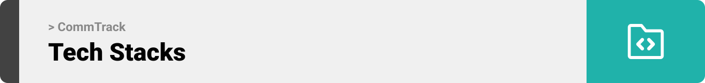

###  CommTrack is built using the following technologies:

- **MERN Stack**: The app is built using MongoDB, Express.js, React, and Node.js, providing flexible foundation for both the frontend and backend.
- **Slack API**: It integrates with Slack workspaces to track communication and manage productivity directly within Slack channels.
- **OpenAI API**: Used to analyze messages and generate intelligent alerts, helping track behavior, engagement, and productivity.

<br><br>
<!-- UI UX -->


> We developed CommTrack through a series of wireframes and mockups, refining the design with each iteration to ensure an intuitive layout and smooth user experience.

- Project Figma design [figma](https://www.figma.com/design/qpQtll5KnC3BtoPWU0HvbS/Final-Project?node-id=0-1&p=f&t=y5Vq6ThOrdSapxhR-0)


### Mockups
| Landing screen  | Sign In Screen |
| ---| ---|
| 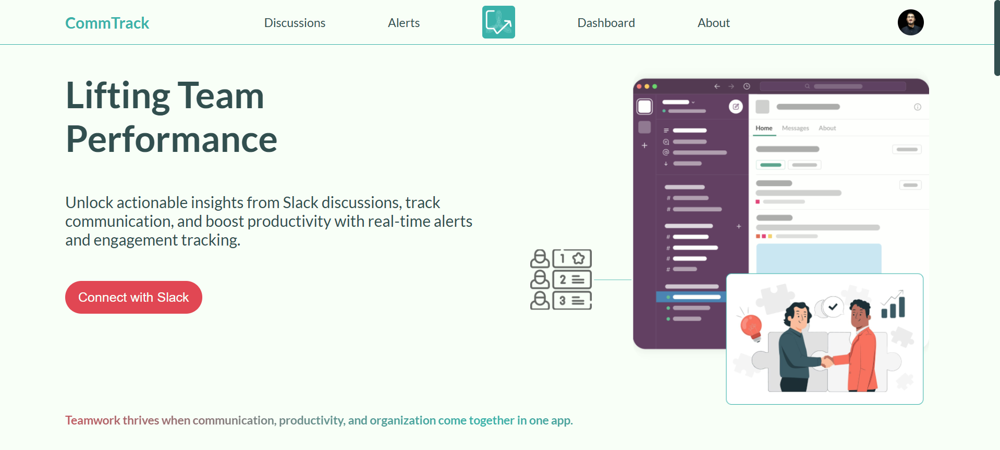 | 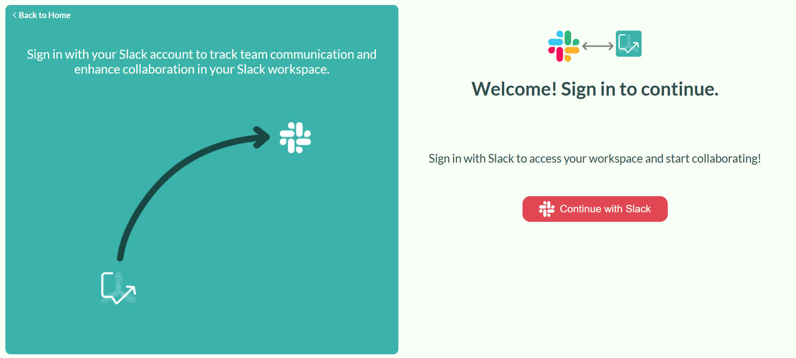 |

<br><br>

<!-- Database Design -->
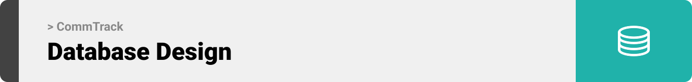

###  Architecting Data Excellence: Innovative Database Design Strategies:

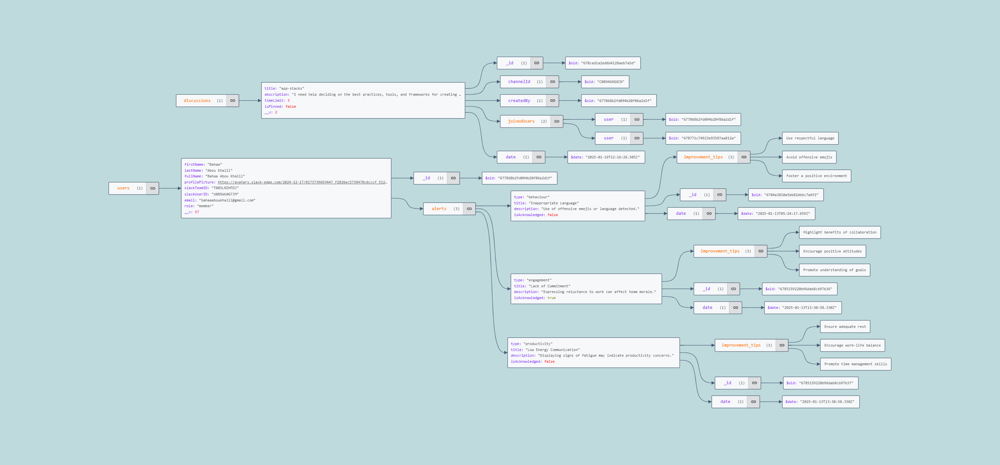

<br><br>


<!-- Implementation -->
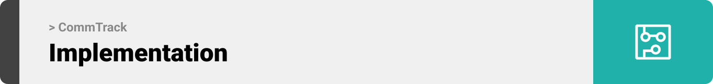


### User Screens
| Request Discussion  | Search Discussion |
| ---| ---|
| 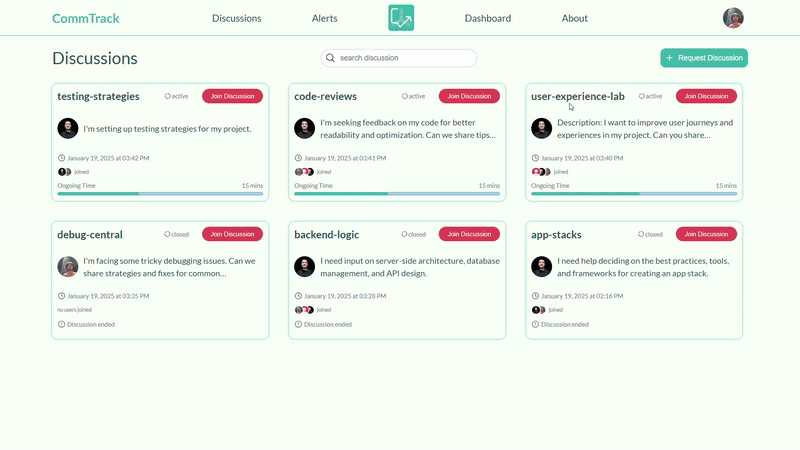 | 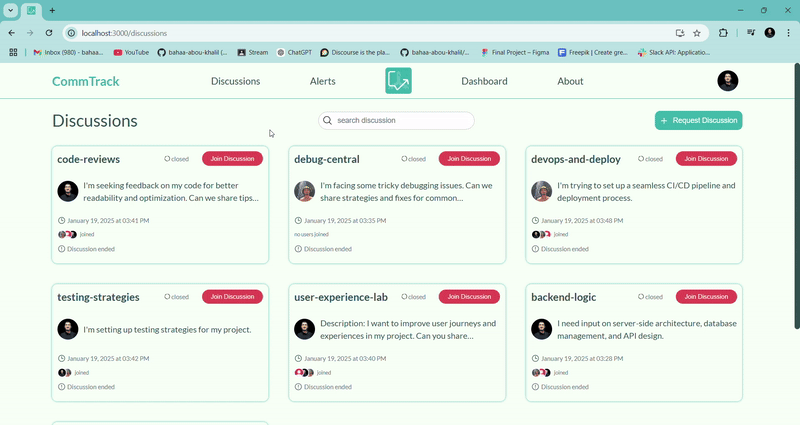 |
| Join Discussion  | Acknowledge Alert |
| 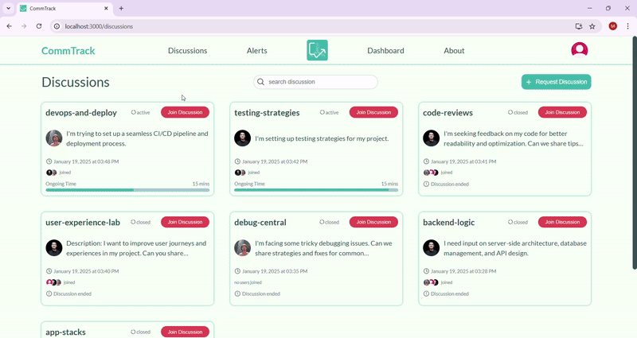 | 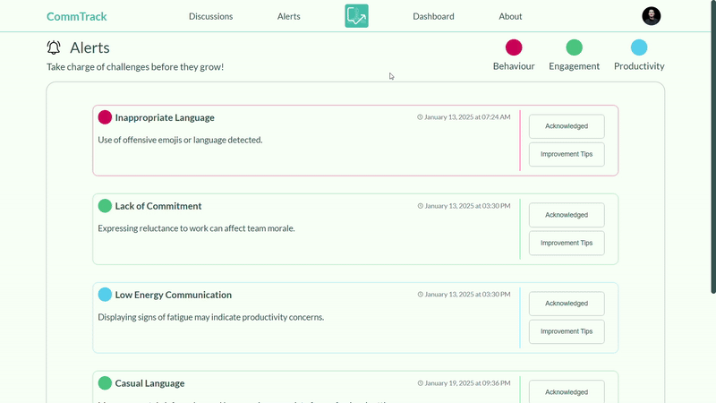 |
| Alert Tips  | Logout |
| 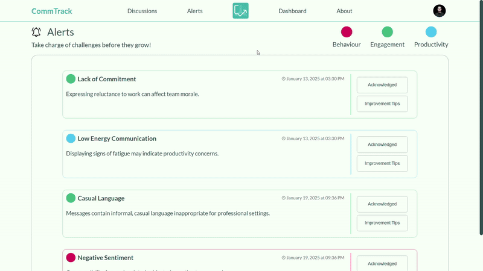 | 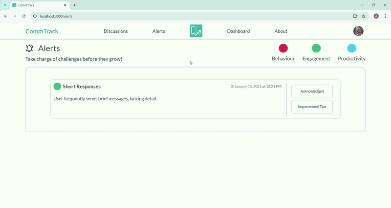 |

### Leader Screen
| Pin Discussion  |
| ---|
| 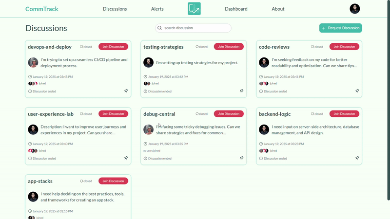 |


### Admin Screens
| Dashboard Activity  | Leaderboard and Alerts |
| ---| ---|
| 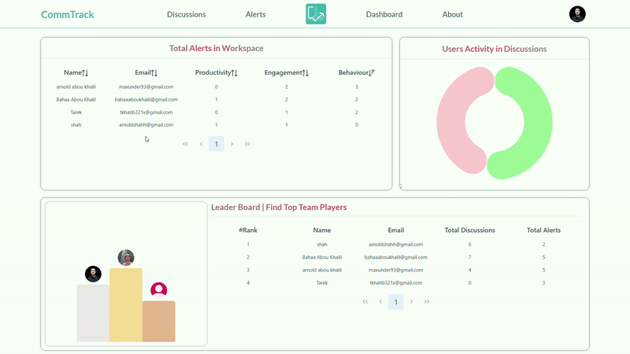 |  |

<br><br>


<!-- Prompt Engineering -->
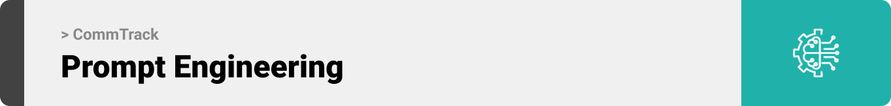

### Mastering AI Interaction: Unveiling the Power of Prompt Engineering:

- The app leverages prompt engineering to analyze user messages for violations in behavior, engagement, and productivity.
- Prompts are structured to generate clear, actionable alerts, grouping them by user and ensuring all outputs follow a strict JSON schema.
- Continuous refinement of the prompts ensures accuracy and efficiency, providing users with valuable insights and improvement tips.

<br><br>

<!-- How to run -->


> To set up Coffee Express locally, follow these steps:

### Prerequisites

This is an example of how to list things you need to use the software and how to install them.
* npm
  ```sh
  npm install npm@latest -g
  ```

### Installation

_Below is an example of how you can instruct your audience on installing and setting up your app. This template doesn't rely on any external dependencies or services._

1. Get a free API Key at [example](https://example.com)
2. Clone the repo
   git clone [github](https://github.com/your_username_/Project-Name.git)
3. Install NPM packages
   ```sh
   npm install
   ```
4. Enter your API in `config.js`
   ```js
   const API_KEY = 'ENTER YOUR API';
   ```

Now, you should be able to run Coffee Express locally and explore its features.
