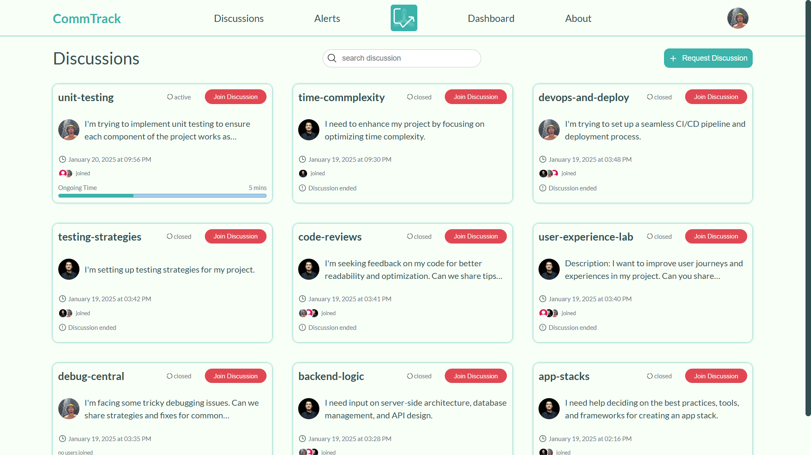
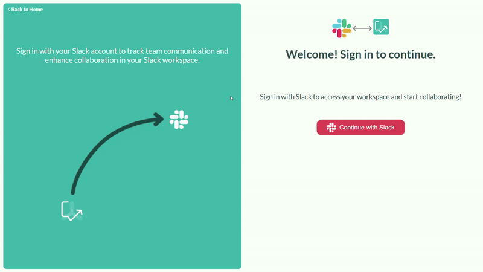
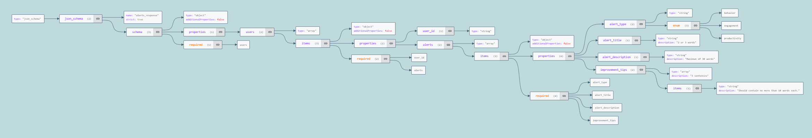

<br><br>

<!-- project philosophy -->


> CommTrack is designed to improve communication and collaboration within teams by working directly with Slack.
>
> As a Slack app, it allows users to track and manage their behavior, engagement, and productivity. This integration helps keep teams connected, motivated, and focused on their goals, creating a supportive environment where members can collaborate more effectively and improve their overall performance.

## User Stories
### Team Member
- As a team member, I want to receive personalized alerts regarding behavior, engagement, and productivity based on my interactions and communication.
- As a team member, I want to be able to open and join discussions on specific topics to enhance collaboration.
- As a team member, I want to compete on leaderboards so I can motivate myself to engage more in team activities.
### Team Leader
- As a team leader, I want to pin important discussions to easily track key information.
### Admin
- As an admin, I want to view user activity on discussions to monitor engagement.
- As an admin, I want to track total alerts to measure team responsiveness.
- As an admin, I want to view a leaderboard of team members to highlight top performers.
<br><br>
<!-- Tech stack -->


###  CommTrack is built using the following technologies:

- **[MERN Stack](https://www.mongodb.com/mern-stack)**: The app is built using MongoDB, Express.js, React, and Node.js, providing a flexible foundation for both the frontend and backend.  
- **[Slack API](https://api.slack.com/)**: Integrates with Slack workspaces to track communication and manage productivity directly within Slack channels.  
- **[OpenAI API](https://platform.openai.com/overview)**: Analyzes messages and generates intelligent alerts, helping track behavior, engagement, and productivity.  
- **[Events API](https://api.slack.com/apis/connections/events-api)**: Listens to active discussions and stores joined users in the database in real time.  
- **[Socket.IO](https://socket.io/)**: Monitors the database to identify when users join channels immediately after they do.  
- **[MUI](https://mui.com/)** and **[PrimeReact](https://primereact.org/)**: Used for efficient and responsive designs, enhancing the user experience.  
- **[Fuse.js](https://fusejs.io/)**: Implements advanced search logic for improved search functionality.  


<br><br>
<!-- UI UX -->


> We developed CommTrack through a series of wireframes and mockups, refining the design with each iteration to ensure an intuitive layout and smooth user experience.

- Project Figma design [figma](https://www.figma.com/design/qpQtll5KnC3BtoPWU0HvbS/Final-Project?node-id=0-1&p=f&t=y5Vq6ThOrdSapxhR-0)


### Mockups
| Landing screen  | Discussions Screen |
| ---| ---|
|  |  |

<br><br>

<!-- Database Design -->


<br><br>


<!-- Implementation -->


### User Screens
| Request Discussion  | Search Discussion |
| ---| ---|
|  |  |
| Join Discussion  | Acknowledge Alert |
|  |  |
| Alert Tips  | Slack OAuth |
|  |  |

### Leader Screen
| Pin Discussion  |
| ---|
|  |


### Admin Screens
| Dashboard Activity  | Leaderboard and Alerts |
| ---| ---|
|  |  |

<br><br>


<!-- Prompt Engineering -->


### Engineering Interaction with OpenAI  

The app leverages prompt engineering to analyze user messages for violations in behavior, engagement, and productivity. The API accepts an array of JSON objects as a parameter, where each object includes the following fields:  
- **user_id**: Unique identifier for the user.  
- **messages**: Array of messages sent by the user.  
- **timestamp**: The timestamp of when each message was sent.

---

## Prompt Structure  
```
[
  {
    "role": "system",
    "content": "You are an expert in analyzing structured data to structured output, talking with the members directly in simple and professional English."
  },
  {
    "role": "user",
    "content": "Determine if the messages of each user violate specific guidelines in behavior, engagement, and productivity."
  },
  {
    "role": "user",
    "content": JSON.stringify(transformedMessages)
  },
  {
    "role": "user",
    "content": "Group all alerts by the user_id field in the input data. Each user in the output should have a 'user_id' field and an 'alerts' array containing all alerts for that user."
  }
]
```
| Response Format  |
| ---|
|  |
<br><br>

<!-- How to run -->


> To set up Coffee Express locally, follow these steps:

### Prerequisites

This is an example of how to list things you need to use the software and how to install them.
* npm
  ```sh
  npm install npm@latest -g
  ```

### Installation

_Below is an example of how you can instruct your audience on installing and setting up your app. This template doesn't rely on any external dependencies or services._

1. Get a free API Key at [example](https://example.com)
2. Clone the repo
   git clone [github](https://github.com/your_username_/Project-Name.git)
3. Install NPM packages
   ```sh
   npm install
   ```
4. Enter your API in `config.js`
   ```js
   const API_KEY = 'ENTER YOUR API';
   ```

Now, you should be able to run Coffee Express locally and explore its features.
